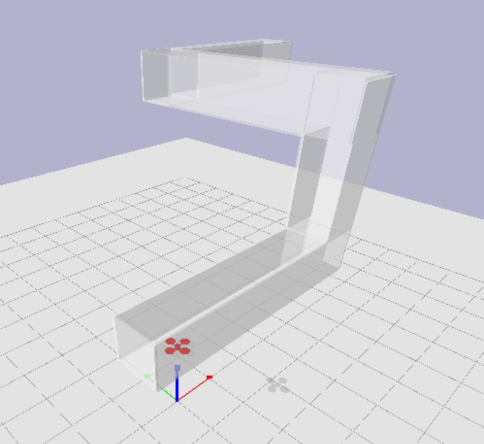

# Simple Quadcopter simulation
taken from [bullet 3 examples](https://github.com/bulletphysics/bullet3)



## Prerequisites

Install `pybullet`

```bash
pip install pybullet
```

## Usage

```bash
python quadrocopter.py
```

**Controls:**
 - Use the slider to add a "base force" equally to all rotors. 
 - Use the arrow keys to adjust the force of each rotor individually.
 
 ### Reinforcement Learning Challenge
 
 Steer the quadrocopter to the position `[8.5, 5., 5.]` without collision
 and hover for 5 seconds. Use the quadrocopter's six distance sensors in 
 *up, down, forward, backward, left, right* directions.